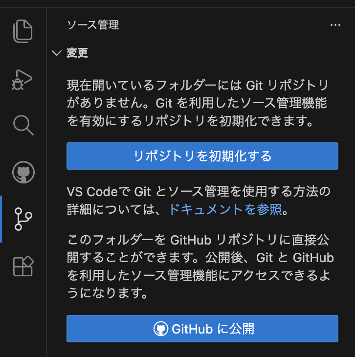

[](https://classroom.github.com/a/seXpVPLM)
[](https://classroom.github.com/online_ide?assignment_repo_id=22341093&assignment_repo_type=AssignmentRepo)
# プログラミング応用

## 課題

芸術専門学群の「プログラミング応用」では、得点の概念を持ったゲームを開発してください。
「プログラミング基礎」でAIを用いた開発環境の構築を行いましたが、今回もその環境を活用して開発を行います。
成果物は以下を全て満たしていることが条件です。

1. 初回授業で配布したテンプレートファイルを用いて開発すること
2. ゲームの結果を得点として表現していること
3. Webブラウザで動作するアプリケーションであること
4. Javascript を使用し、ES6に準拠していること
5. ゲームエンジンとしてPixiJS 8.0を用いること
6. ゲームのルートから配置する要素(各画面やゲームキャラクターなど)はクラスとしてファイルを分割してプログラミングすること
7. GitHub でソースコードを管理し、gitflow のルールでコードを修正する過程を全てコミット履歴に残すこと
8. AIに指示した内容を履歴として全て提出すること

## GitHubt と Git

### 1. git を理解する

「git」はソースコードを管理するための仕組みですが、AIでの開発を進めるうえで、いろいろな機能を段階的に開発して管理するためにも、その仕組みを理解しておく必要があります。

GitHub と Git について
https://docs.github.com/ja/get-started/start-your-journey/about-github-and-git

手順を追って、どのように開発するかを見ていきましょう。

### 2. コマンドラインから設定を確認しよう

git は主にコマンドラインから使用しますが、VS Code から利用する場合、初期設定をやっておけばその後にコマンドラインを使用しなくても通常の作業は行えます。

- ユーザー名の確認と設定
```console
# ユーザー名を確認する
git config --global user.name

# ユーザー名を登録する
git config --global user.name "Your Name"
```

- メールアドレスの確認と設定
```console
# メールアドレスを確認する
git config --global user.email

# メールアドレスを登録する
git config --global user.email "you@example.com"
```

### 3. git リポジトリを設定しよう

VS Code から github リポジトリを設定しよう 。

1. まず最初に、みなさんがダウンロードしたプロジェクトフォルダの名前を変更しましょう。
   「project_01」となっているフォルダを任意の名前に変更してください。GitHub 上にこの名前が表示されるので、作りたいゲームの内容を示す名前が望ましいです。
   名前は英数字のみで構成してください。日本語絶対ダメ。
2. メニューから git を選択し、「**GitHubに公開**」を選ぶ
   

### 4. git のブランチを活用しよう

ブランチとは、作業中のファイルから分岐して、別の作業を行うための仕組みです。
例えば、みなさんがゲームのキャラクターを追加する作業を行う場合、現在のファイルから分岐して、そのブランチ上でキャラクターの追加作業を行い、完成したら元のファイルに統合することができます。
こうすることで、元のファイルを壊すことなく、新しい機能を追加することができます。

### 5. gitflow とは

gitflow は git のブランチ管理方法のひとつで、開発の流れを体系化したものです。
AIを用いた開発を行う際、一人で開発しているというよりも、何人かの作業者がいる状態に近くなりますので、まずはこの方法を身に着けましょう。

git-flow チートシート
https://danielkummer.github.io/git-flow-cheatsheet/index.ja_JP.html

### 6. gitflow を設定しよう

1. VS Code の拡張機能から「gitflow」と「Gitflow Actions Sidebar」をインストールします。

2. ターミナルで以下を打つか、AIに「gitflowで初期化して」とお願いする

```console
git flow init -d
```

### 7. 実際に開発しながら使ってみよう

AIで開発すると、元のソースコードを大きく改変して、正しい動作が担保できなくなることがあります。
そのためにも、履歴を管理しておくことは非常に重要です。

1. 常にみなさんが開発するブランチは「develop」が基本ですが、新しい機能を追加する場合は「feature/機能名」というブランチを作成して、そのブランチ上で開発を行います。
2. 開発を行う度にコミットしましょう。コミットは自分で行ってもよいですが、AIにコミットしてもらうと履歴に変更内容を書いてくれます。
3. 機能が完成したら、そのブランチを「develop」ブランチに統合します。
4. これらの一連の作業を、GItflow Actions を使って管理します。

